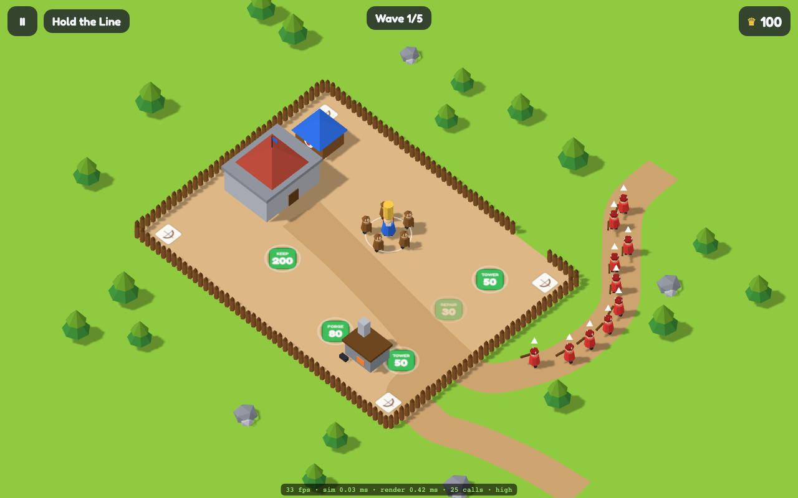
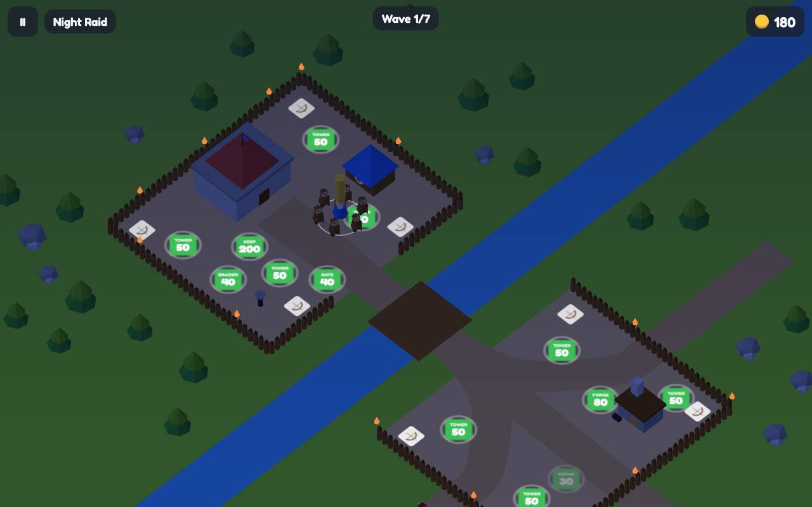
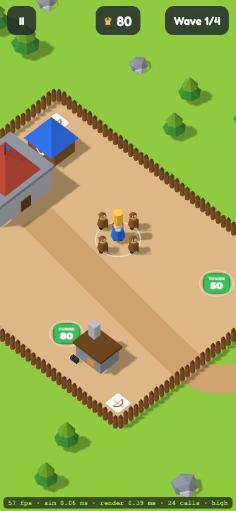

# Crownstack

You are a tiny king carrying a tower of coins on your head. Walk over gold to stack it, spend it
at the forge and build plots to arm your archers, and hold the palisade against waves of red
raiders and pink giants.

**Play:** https://crownstack-six.vercel.app

Crownstack is an installable, offline-capable web game (PWA) for phones and laptops: 12 levels on
four maps, three difficulties, and a small upgrade tree. No backend, no login, no ads, no trackers.
All art and audio are generated in code.



| Night raid on River C                         | Portrait on a phone                           |
| --------------------------------------------- | --------------------------------------------- |
|  |  |

## How to play

|          | Move                                          | Dash (level 4+) | Pause            |
| -------- | --------------------------------------------- | --------------- | ---------------- |
| Touch    | Drag anywhere on the lower part of the screen | Double-tap      | Button, top-left |
| Keyboard | WASD / arrows                                 | Space           | Esc or P         |
| Mouse    | Click and hold: the king walks to the cursor  | –               | Button           |
| Gamepad  | Left stick                                    | A               | Start            |

There is no attack button. Archers and towers aim themselves; your job is **where you stand and
what you buy**. Stand on a green pad to pay for it with the coins on your head. Coins dropped
outside the fence vanish after 20 seconds, so fetching them means leaving the yard.

## Develop

Requires the Node version in `.nvmrc` and pnpm.

```bash
pnpm install
pnpm dev
```

| Script           | What it does                                                                           |
| ---------------- | -------------------------------------------------------------------------------------- |
| `pnpm dev`       | Vite dev server                                                                        |
| `pnpm build`     | Production build + 5 MB precache budget check                                          |
| `pnpm preview`   | Serve the production build on :4173                                                    |
| `pnpm lint`      | ESLint + Prettier check                                                                |
| `pnpm typecheck` | `tsc --noEmit` (strict)                                                                |
| `pnpm test`      | Vitest: simulation, economy, waves, content, save migrations, every level won by a bot |
| `pnpm size`      | Initial JS budget (350 KB gzip)                                                        |
| `pnpm e2e`       | Playwright (desktop + Pixel 7) against `pnpm preview`; run `pnpm build` first          |
| `pnpm bot`       | Level-tuning table: careful and naive bots on every level                              |
| `pnpm capture`   | Scripted headless playthrough with screenshots (`VIDEO=1` for a WebM)                  |
| `pnpm maps`      | Regenerate `src/content/maps/*.json`                                                   |
| `pnpm icons`     | Regenerate the PWA icons                                                               |

Add `?debug=1` to the URL for a frame-time overlay (fps, sim ms, render ms, draw calls, quality
tier). `?quality=low` or `?quality=high` forces a render tier.

## Architecture

```
Input ──intents──▶ Simulation (pure, 60 Hz, seeded) ──snapshot──▶ Renderer (three.js)
Content JSON (Zod-validated) ──▶ Simulation ──events──▶ UI shell (React + Zustand) / Audio
UI shell ◀──▶ Save (IndexedDB, localStorage fallback)
```

- `src/game/sim` is pure TypeScript: a struct-of-arrays ECS stepped at a fixed 1/60 s, with one
  seeded RNG. No DOM, no three.js, no `Math.random`, no clock; ESLint enforces it and a replay
  test checks it. The same code runs in the browser, the unit tests and the tuning bots.
- `src/game/render` reads simulation state and draws it: one instanced mesh per unit type, merged
  terrain, canvas-atlas labels. A busy level is about 18 draw calls (25 with shadows).
- `src/content` holds every level, map and stat as JSON. A new level is one level file plus, if
  needed, one map file. See [AGENTS.md](AGENTS.md).

The full design is in [SPEC.md](SPEC.md). Choices the spec leaves open are logged in
[DECISIONS.md](DECISIONS.md).

## Budgets

| Budget                        | Target                        | Now     | Enforced by                        |
| ----------------------------- | ----------------------------- | ------- | ---------------------------------- |
| Initial JS (gzip)             | ≤ 350 KB                      | ~253 KB | `pnpm size` in CI                  |
| Precache                      | ≤ 5 MB                        | ~1 MB   | `pnpm build`                       |
| Simulation step, 300 entities | ≤ 3 ms                        | ~0.7 ms | unit test                          |
| Draw calls                    | ≤ 40                          | 18–25   | e2e on level 10                    |
| Lighthouse (mobile)           | Perf ≥ 90, A11y ≥ 95, BP ≥ 95 | nightly | `.github/workflows/lighthouse.yml` |

## Before tagging 1.0

The automated checks cannot cover these; they need a person with real devices:

- [ ] 60 fps on a mid-range Android phone (Pixel 6a class) in level 10, checked with `?debug=1`
- [ ] Installs from Android Chrome and from iOS Safari (Share → Add to Home Screen)
- [ ] Plays level 1 offline after the first load on both
- [ ] Sound starts on the first touch; vibration on pad purchases (Android)
- [ ] Safe areas and both orientations look right on a notched phone
- [ ] Levels 4–12 feel fair when played by hand (they are tuned by bot)

## Licence

MIT. Crownstack is an original game; it uses no assets, names or characters from any other game.
Third-party assets are listed in [ASSETS.md](ASSETS.md).
